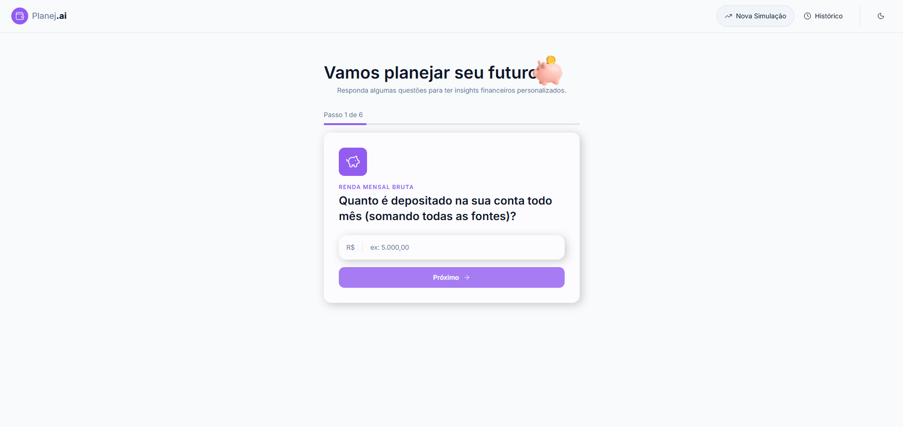
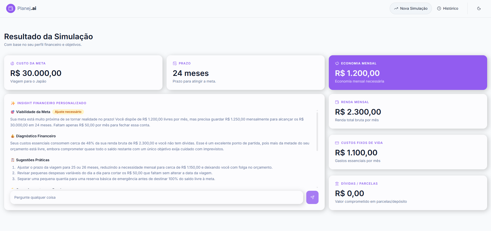
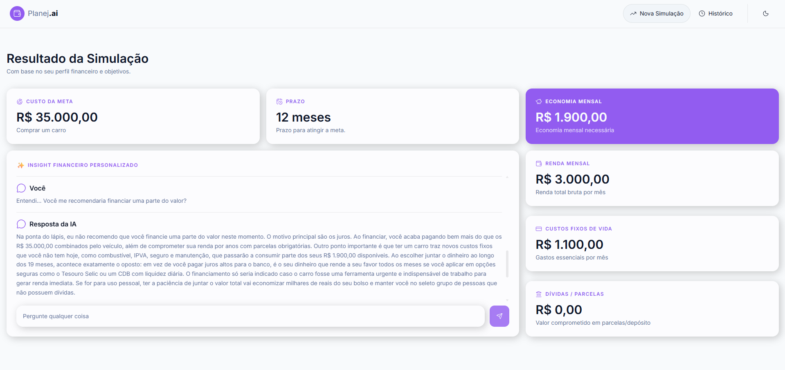
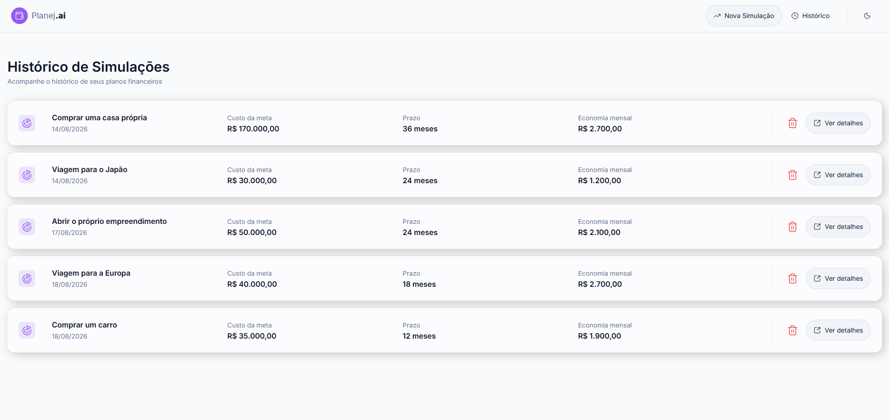
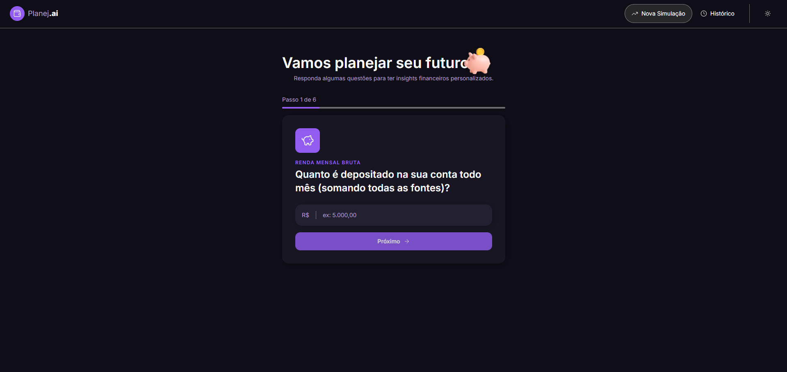
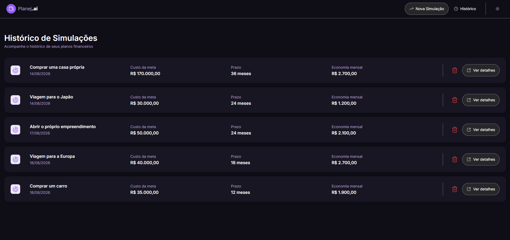
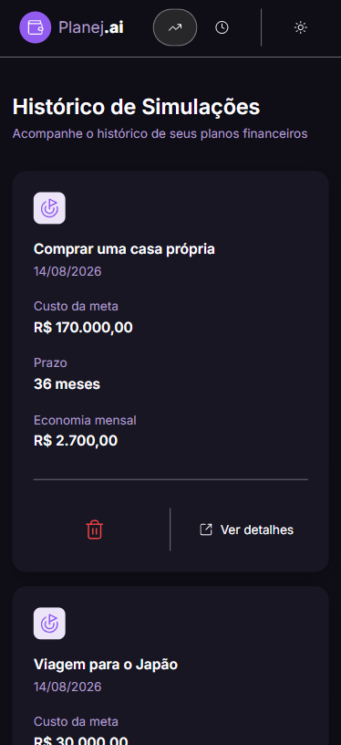

# _Planej.ai - Bootcamp Santander 2026 - AI React Front-end_

## 📌 Sobre o projeto

O planej.ai é uma aplicação web feita em React e TypeScript, funcionando como um educador financeiro integrado com inteligência artificial.

A aplicação permite que o usuário realize uma simulação financeira através de um formulário dividido em seis etapas. A partir dos dados fornecidos, são feitos cálculos e as informações são enviadas à IA, que gera um insight financeiro personalizado, com uma análise da situação atual e sugestões para ajudar o usuário a alcançar seu objetivo.

O projeto foi desenvolvido como parte do Bootcamp Santander 2026 — AI React Front-end, da DIO em parceria com o Santander.

### 🛠️ Tecnologias utilizadas

- **React** — construção da interface
- **TypeScript** — tipagem e desenvolvimento
- **Vite** — ambiente de desenvolvimento e build
- **Tailwind CSS** — estilização e responsividade
- **React Router** — gerenciamento das rotas
- **Lucide React** — ícones da interface
- **React Loading Skeleton** — estados de carregamento
- **Google Gemini API** — geração dos diagnósticos e respostas do chat
- **LocalStorage** — persistência das simulações e conversas

### 🔧 Ferramentas de desenvolvimento

- ESLint
- Prettier
- Git / GitHub

## ✨ FUNCIONALIDADES

### 📝 Formulário multi-step:

O formulário é dividido em seis etapas e coleta as seguintes informações:

- renda mensal;
- gasto mensal com despesas;
- valor comprometido com dívidas por mês;
- Meta financeira;
- Custo da meta;
- Prazo para alcançar a meta, em meses.



### 🤖 Diagnóstico financeiro

Após o preenchimento do formulário, o usuário é direcionado para a página do resultado da simulação, onde são apresentados:

- Os dados informados pelo usuário;
- O cálculo da economia mensal necessária para alcançar a meta dentro do prazo definido;
- Um insight financeiro personalizado gerado pela inteligência artificial;
- Sugestões e possíveis ajustes baseados no perfil financeiro apresentado.



### 📲 Chat contextualizado

O usuário também pode fazer perguntas para a IA, utilizando um chat contextualizado a partir da simulação e do insight personalizado.



### 📚 Histórico de simulações:

As simulações realizadas ficam disponíveis em uma página de histórico, onde o usuário pode:

- Visualizar um resumo de cada simulação;
- Acessar novamente seus resultados;
- Excluir simulações que não deseja mais manter.



### 🌓 Tema claro e escuro

A aplicação também possui suporte aos temas claro e escuro, permitindo alternar a aparência da interface conforme a preferência do usuário.



### 📱 Design responsivo

A interface foi desenvolvida para se adaptar a diferentes tamanhos de tela, proporcionando uma experiência adequada tanto em desktop quanto em dispositivos móveis.




# 🚀 Como executar o projeto

### Pré-requisitos

- Node.js
- npm

### Instalação

```bash
git clone ...
cd planejai
npm install
```

### Variáveis de ambiente

Crie um arquivo .env.local na raiz do projeto:

```.env.local
VITE_GEMINI_API_KEY=sua_chave_aqui
```

Para obter uma chave, acesse o [Google AI Studio](https://aistudio.google.com) e clique em "Get API Key".

### Executando o servidor

Inicie o servidor de desenvolvimento:

```bash
npm run dev
```

A aplicação estará disponível no endereço exibido pelo Vite.

Também é possível gerar e rodar uma versão de produção:

```bash
npm run build
npm run preview
```
